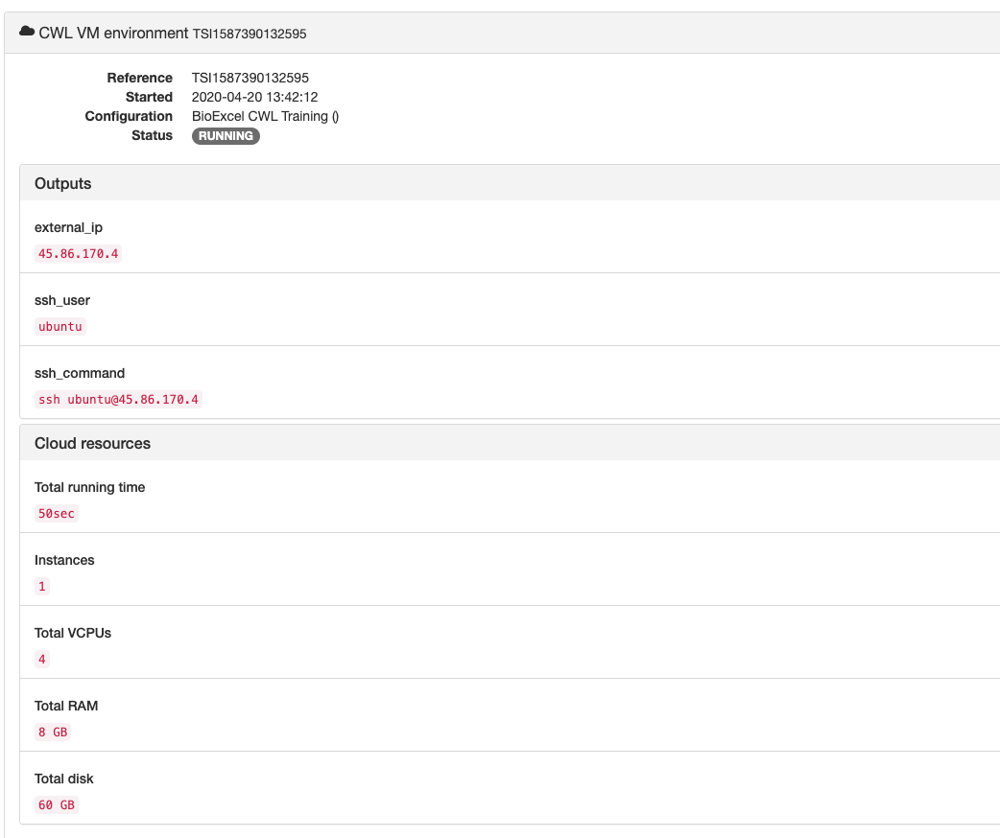

===============
Building the VM
===============

Assuming you have followed the previous steps and checked that they worked, you should be ready to build the VM.

Creating a VM
=============

1. Log in to the BioExcel Portal again, if not already logged in.
2. On the main Page (or Tools) you should be able to see ‘CWL Training’ item

   .. image:: images/image1.png
      :width: 400
	      
3. Click **CWL Training** item to expand it.

   .. image:: images/image14.png
      :width: 400
	      
4. Click **Deploy "CWL Training" to BioExcel CWL Training** button.
5. The popup will show asking you for your public SSH key. Provide the entire contents of the file with your public key (default should be called id_rsa.pub. The key normally starts with ssh-rsa)

   .. image:: images/image12.png
     :width: 400
	     
6. You will be taken to Deployments page:

   .. image:: images/image11.png
      :width: 400
	      
7. Click the item with CWL VM environment.
8. You will see that Status is STARTING and below “Deploying...” 

   .. image:: images/image4.png
      :width: 400
	      

Verifying the VM
================

It can take up to 10 minutes for the VM to build (or deploy). By that time you should see something like this:

If the status of your deployment has not changed to RUNNING, log out of the portal (link below Profile) and log in again, choose Deployments from the top menu and click the item with your deployment. If that does not help, please contact us at ecp@ebi.ac.uk
